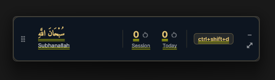
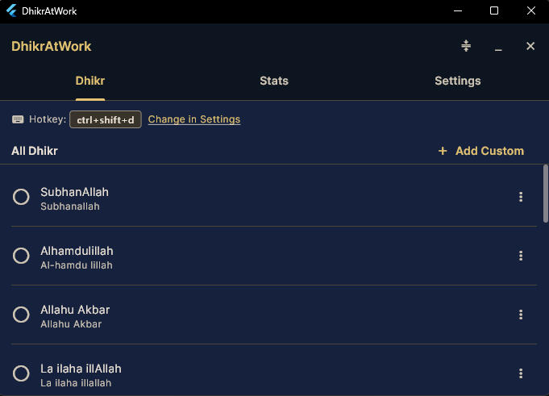

# DhikrAtWork

<p align="center">
  
</p>

A desktop dhikr counter that stays on your screen while you work. Track your daily adhkar, build streaks, and grow — one press at a time.

> **Help wanted:** The donation system is not yet functional — the `SubscriptionService` is stubbed out and no payment integration exists. This is our highest-priority feature. If you have experience with Stripe, RevenueCat, or similar payment platforms in Flutter, we'd love your help. See [Donations & Payments on the roadmap](#donations--payments) and [CONTRIBUTING.md](CONTRIBUTING.md) to get started.

**Windows** &bull; **macOS** &bull; Open Source &bull; Donations go to charity (coming soon)

[](https://github.com/thecodeartificerX/dhikratwork/releases/latest)
[](https://github.com/thecodeartificerX/dhikratwork/releases/latest)


---

## What It Does

DhikrAtWork runs as a slim, always-on-top counter bar that sits over your other windows. Press a global hotkey to count without switching apps. Expand it when you want to see stats, set goals, or manage your dhikr library.

### Compact Mode — Always-on-Top Counter

<p align="center">
  
</p>

A small frameless bar (520x100) that floats above everything. Drag it anywhere. Shows your active dhikr in Arabic, the session count, today's count, and your hotkey — all at a glance.

- **Global hotkey** (default `Ctrl+Shift+D`) — count from any app without switching windows
- **Session & daily counters** — reset independently, right-click for more options
- **Drag anywhere** — position is remembered across sessions, clamped to screen edges on multi-monitor setups

### Expanded Mode — Full Interface

<p align="center">
  
</p>

Click expand to open the tabbed interface (700x500) with three tabs:

**Dhikr Tab** — Browse and manage your dhikr library. Select an active dhikr, add custom entries with full Arabic tashkeel support, hide or delete entries.

**Stats Tab** — See your progress across day, week, and month:
- Bar chart (counts by dhikr) and line chart (counts over time)
- XP level progression (Beginner through Muhsin — 9 levels)
- Current and best streaks
- Achievement badges (9 milestones from first dhikr to 100-day streak)
- Goal progress bars (daily, weekly, monthly targets)

**Settings Tab** — Configure your hotkey, export data (JSON/CSV), manage your donation subscription, and more.

### System Tray

Closing the window hides it to the system tray — DhikrAtWork keeps running in the background. The global hotkey stays active. Right-click the tray icon to quit.

---

## Preloaded Library

Ships with 15 adhkar across five categories, all with full Arabic tashkeel and hadith references:

| Category | Includes |
|---|---|
| **General Tasbih** | SubhanAllah, Alhamdulillah, Allahu Akbar, La ilaha illAllah, and more |
| **Post-Salah** | The 33-33-34 tasbih set, Ayat al-Kursi |
| **Istighfar** | Astaghfirullah, Sayyid al-Istighfar |
| **Salawat** | Durood Ibrahim |
| **Dua & Remembrance** | Hawqala, HasbunAllah |

Add your own custom dhikrs with Arabic text, transliteration, translation, and optional target counts.

---

## Download & Install

Download the latest release from the [GitHub Releases page](https://github.com/thecodeartificerX/dhikratwork/releases/latest).

### Windows

1. Download `DhikrAtWork-vX.Y.Z-windows-x64.zip`
2. Extract the zip — you will see `README.txt`, `Install.bat`, `DhikrAtWork.cer`, and `DhikrAtWork.msix`
3. Right-click `Install.bat` and select **Run as Administrator**
4. If Windows SmartScreen appears, click **More info** → **Run anyway**
5. Follow the prompts — the installer imports the certificate and installs the app
6. The app launches automatically after installation

After install, DhikrAtWork appears in your Start Menu and sets up automatic background update checks every 12 hours.

### macOS

1. Download `DhikrAtWork-vX.Y.Z-macos-arm64.zip`
2. Extract the zip and drag `DhikrAtWork.app` to your **Applications** folder
3. **Do not double-click to open** — right-click (or Control-click) `DhikrAtWork.app` and select **Open**
4. Click **Open** in the Gatekeeper confirmation dialog
5. This one-time step is only required on first launch

After install, the app checks for updates automatically every 24 hours in the background.

### Security & Trust

DhikrAtWork is **free open-source software** distributed without paid code signing certificates. Paid certificates cost hundreds of dollars per year — skipping them keeps the project entirely free.

You can verify the app yourself:
- **Check SHA256 checksums** — each release includes `.sha256` files. Verify your download matches:
  - Windows: `certutil -hashfile DhikrAtWork-vX.Y.Z-windows-x64.zip SHA256`
  - macOS: `shasum -a 256 DhikrAtWork-vX.Y.Z-macos-arm64.zip`
- **Scan on VirusTotal** — links to VirusTotal scan results are included in each release's notes
- **Review the source code** — everything is in this repository; nothing is hidden

The Windows installer imports a self-signed certificate (`DhikrAtWork.cer`, included in the zip and committed to this repo) into your Trusted Root store. This is required for MSIX installation and Windows auto-updates. If you prefer, you can inspect `Install.bat` before running it — it is a plain text file.

### Build From Source

Requires [Flutter](https://docs.flutter.dev/get-started/install) 3.11+.

```bash
git clone https://github.com/thecodeartificerX/dhikratwork.git
cd dhikratwork
flutter pub get
flutter run -d windows   # or: -d macos
```

---

## Development

### Project Structure

```
lib/
  app/           # Theme, AppLocator (cross-feature VM wiring)
  data/          # Seed data (preloaded dhikrs)
  models/        # Immutable domain objects
  repositories/  # SQLite access with in-memory cache
  services/      # Platform integrations (DB, tray, hotkey, update, subscription)
  utils/         # Constants (all SQL names live here)
  viewmodels/    # ChangeNotifier VMs
  views/         # UI — app_shell.dart, compact/, expanded/, shared/, stats/, settings/
```

Architecture: **MVVM + Provider** with manual constructor injection. No code generation, no service locators (except `AppLocator` for two cross-feature ViewModels).

### Commands

```bash
# Run with hot reload
.\run.ps1                            # Windows (debug)
.\run.ps1 -Release                   # Windows (release)
flutter run -d macos                 # macOS

# Build
.\build.ps1                          # Full pipeline: clean, pub get, analyze, test, build
.\build.ps1 -SkipClean -SkipTests    # Quick rebuild

# Test
flutter test                         # ~300 unit + widget tests
flutter test integration_test/ -d windows  # Integration tests

# Analyze
flutter analyze
```

### Testing

Three tiers, all using **fakes** (never mocks):

- **Unit (repositories)** — `FakeDatabaseService` with in-memory map store
- **Unit (ViewModels)** — `Fake{Repository}` classes with `seed()`/`reset()` methods
- **Widget** — `ChangeNotifierProvider.value` wrapping fakes, pump the screen, verify UI
- **Integration** — Real `DatabaseService` with an in-memory SQLite database

All fakes live in `test/fakes/` and follow the naming pattern `Fake{ClassName}`.

---

## Contributing

Contributions are welcome! See [CONTRIBUTING.md](CONTRIBUTING.md) for setup instructions, code conventions, and the PR process.

Good first contributions: new preloaded adhkar, achievement ideas, translations, and [open issues](https://github.com/thecodeartificerX/dhikratwork/issues).

---

## Mission

DhikrAtWork is built to do good in the world. The app is free to use, but each day before you start, you'll see a brief reminder about the humanitarian crisis in Palestine and Gaza — and an invitation to donate.

A $5/month subscription removes the daily reminder. All donation revenue goes directly to charitable relief efforts. If you cancel, the reminders return. This is how we turn everyday dhikr into real-world impact.

---

## Roadmap

### Donations & Payments
- [ ] Daily donation interstitial — shown once per day on app launch, dismissable with "Not now"
- [ ] $5/month subscription to remove the daily interstitial
- [ ] Payment integration (Stripe or similar)
- [ ] Subscription status synced with existing `SubscriptionService` interface
- [ ] Pestering resumes if subscription is canceled
- [ ] Transparency page — show how much has been raised and where it goes

### Features
- [ ] Linux support
- [ ] Floating widget with multiple dhikr counters
- [ ] Cloud sync across devices
- [ ] Notification reminders
- [ ] Themes and customization
- [ ] Haptic/sound feedback options
- [ ] Widget for Windows desktop / macOS Today View
- [ ] Localization (Arabic, Urdu, Turkish, Malay, and more)

---

## Tech Stack

| | |
|---|---|
| **Framework** | Flutter (Windows + macOS desktop) |
| **State** | Provider + ChangeNotifier |
| **Database** | SQLite via sqflite_common_ffi |
| **Charts** | fl_chart |
| **Window** | window_manager |
| **Hotkeys** | hotkey_manager |
| **Tray** | tray_manager |
| **Updates** | auto_updater (Sparkle) |

---

## License

MIT License — see [LICENSE](LICENSE) for details.

---

<p align="center">
  <i>SubhanAllahi wa bihamdihi, SubhanAllahil Azeem</i>
</p>
