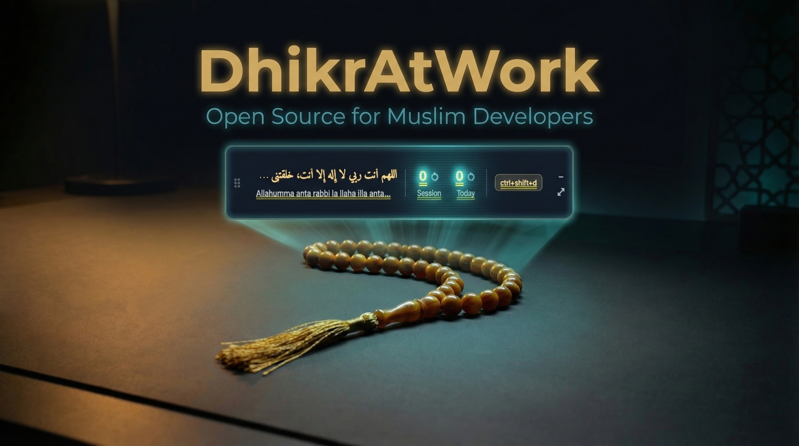

# DhikrAtWork

<p align="center">
  
</p>

A desktop dhikr counter that stays on your screen while you work. Track your daily adhkar, build streaks, and grow — one press at a time.

**Windows** &bull; **macOS** &bull; Free &bull; Open Source

[](https://github.com/thecodeartificerX/dhikratwork/releases/latest)
[](https://github.com/thecodeartificerX/dhikratwork/releases/latest)

---

## What It Does

DhikrAtWork runs as a slim, always-on-top counter bar that sits over your other windows. Press a global hotkey to count without switching apps. Expand it when you want to see stats, set goals, or manage your dhikr library.

### Compact Mode — Always-on-Top Counter

A small frameless bar (520x100) that floats above everything. Drag it anywhere. Shows your active dhikr in Arabic, the session count, today's count, and your hotkey — all at a glance.

- **Global hotkey** (default `Ctrl+Shift+D`) — count from any app without switching windows
- **Session & daily counters** — reset independently, right-click for more options
- **Drag anywhere** — position is remembered across sessions, clamped to screen edges on multi-monitor setups

### Expanded Mode — Full Interface

Click expand to open the tabbed interface (700x500) with three tabs:

**Dhikr Tab** — Browse and manage your dhikr library. Select an active dhikr, add custom entries with full Arabic tashkeel support, hide or delete entries.

**Stats Tab** — See your progress across day, week, and month:
- Bar chart (counts by dhikr) and line chart (counts over time)
- XP level progression (Beginner through Muhsin — 9 levels)
- Current and best streaks
- Achievement badges (9 milestones from first dhikr to 100-day streak)
- Goal progress bars (daily, weekly, monthly targets)

**Settings Tab** — Configure your hotkey, export data (JSON/CSV), manage subscription, and more.

### System Tray

Closing the window hides it to the system tray — DhikrAtWork keeps running in the background. The global hotkey stays active. Right-click the tray icon to quit.

---

## Preloaded Library

Ships with 15 adhkar across five categories, all with full Arabic tashkeel and hadith references:

| Category | Includes |
|---|---|
| **General Tasbih** | SubhanAllah, Alhamdulillah, Allahu Akbar, La ilaha illAllah, and more |
| **Post-Salah** | The 33-33-34 tasbih set, Ayat al-Kursi |
| **Istighfar** | Astaghfirullah, Sayyid al-Istighfar |
| **Salawat** | Durood Ibrahim |
| **Dua & Remembrance** | Hawqala, HasbunAllah |

Add your own custom dhikrs with Arabic text, transliteration, translation, and optional target counts.

---

## Install

### Download (Recommended)

1. Go to the [latest release](https://github.com/thecodeartificerX/dhikratwork/releases/latest)
2. Download the `.zip` for your platform
3. Extract and run `dhikratwork.exe` (Windows) or `DhikrAtWork.app` (macOS)

No installer needed. All data is stored locally in SQLite.

### Build From Source

Requires [Flutter](https://docs.flutter.dev/get-started/install) 3.11+.

```bash
git clone https://github.com/thecodeartificerX/dhikratwork.git
cd dhikratwork
flutter pub get
flutter run -d windows   # or: -d macos
```

---

## Development

### Project Structure

```
lib/
  app/           # Theme, AppLocator (cross-feature VM wiring)
  data/          # Seed data (preloaded dhikrs)
  models/        # Immutable domain objects
  repositories/  # SQLite access with in-memory cache
  services/      # Platform integrations (DB, tray, hotkey, update, subscription)
  utils/         # Constants (all SQL names live here)
  viewmodels/    # ChangeNotifier VMs
  views/         # UI — app_shell.dart, compact/, expanded/, shared/, stats/, settings/
```

Architecture: **MVVM + Provider** with manual constructor injection. No code generation, no service locators (except `AppLocator` for two cross-feature ViewModels).

### Commands

```bash
# Run with hot reload
.\run.ps1                            # Windows (debug)
.\run.ps1 -Release                   # Windows (release)
flutter run -d macos                 # macOS

# Build
.\build.ps1                          # Full pipeline: clean, pub get, analyze, test, build
.\build.ps1 -SkipClean -SkipTests    # Quick rebuild

# Test
flutter test                         # ~300 unit + widget tests
flutter test integration_test/ -d windows  # Integration tests

# Analyze
flutter analyze
```

### Testing

Three tiers, all using **fakes** (never mocks):

- **Unit (repositories)** — `FakeDatabaseService` with in-memory map store
- **Unit (ViewModels)** — `Fake{Repository}` classes with `seed()`/`reset()` methods
- **Widget** — `ChangeNotifierProvider.value` wrapping fakes, pump the screen, verify UI
- **Integration** — Real `DatabaseService` with an in-memory SQLite database

All fakes live in `test/fakes/` and follow the naming pattern `Fake{ClassName}`.

---

## Contributing

Contributions are welcome! See [CONTRIBUTING.md](CONTRIBUTING.md) for setup instructions, code conventions, and the PR process.

Good first contributions: new preloaded adhkar, achievement ideas, translations, and [open issues](https://github.com/thecodeartificerX/dhikratwork/issues).

---

## Roadmap

Some ideas for the future (contributions welcome!):

- [ ] Linux support
- [ ] Floating widget with multiple dhikr counters
- [ ] Cloud sync across devices
- [ ] Notification reminders
- [ ] Themes and customization
- [ ] Haptic/sound feedback options
- [ ] Widget for Windows desktop / macOS Today View
- [ ] Localization (Arabic, Urdu, Turkish, Malay, and more)

---

## Tech Stack

| | |
|---|---|
| **Framework** | Flutter (Windows + macOS desktop) |
| **State** | Provider + ChangeNotifier |
| **Database** | SQLite via sqflite_common_ffi |
| **Charts** | fl_chart |
| **Window** | window_manager |
| **Hotkeys** | hotkey_manager |
| **Tray** | tray_manager |
| **Updates** | auto_updater (Sparkle) |

---

## License

MIT License — see [LICENSE](LICENSE) for details.

---

<p align="center">
  <i>SubhanAllahi wa bihamdihi, SubhanAllahil Azeem</i>
</p>
